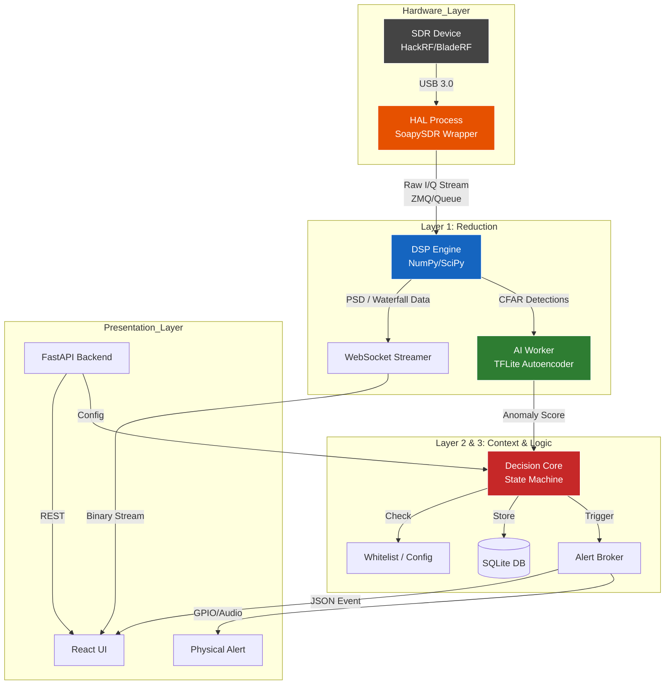

# PROJECT: TALOS — Master Context & Technical Constraints

Version: 1.3  
Status: MVP Phase  
Type: Autonomous SIGINT / Drone Detection System  
Platform: Embedded Linux (ARM64 / x86_64)  
Target Hardware: Orange Pi 5 / Intel N100 + optional Coral AI Accelerator  
Primary SDR Interface: SoapySDR  

This document is the primary and authoritative source of truth for Project TALOS.
All derived documents, AI agent instructions, and implementation decisions must
strictly conform to this file.

---

## 1. Vision & Purpose

TALOS is an autonomous radio monitoring system that replaces the human operator
in continuous spectrum observation tasks.

The system performs 24/7 analysis of the radio spectrum and automatically detects:
1. FPV drones and airborne video links (analog and digital).
2. Control links, including LPI and FHSS protocols.
3. Electronic Warfare (jamming) activity.

The operator is involved only at the validation stage (Human-in-the-Loop),
never during primary detection.

Core philosophy:
- Zero Config during operational use.
- Offline, edge-only execution.
- Deterministic, explainable detection pipeline.

---

## 2. Core Constraints (Non-Negotiable)

1. The system MUST operate fully offline.
2. The system MUST run on embedded hardware (SBC-class).
3. No runtime configuration of gain, frequency, FFT size, or sample rate by the operator.
4. AI inference latency MUST be < 12 ms per fragment.
5. CPU load MUST remain below 75% on 4 cores.
6. Memory usage MUST not exceed 4 GB.
7. The system MUST auto-recover from SDR disconnections within 2 seconds.

---

## 3. Supported SDR Hardware

All SDR interaction MUST go through SoapySDR.
Direct use of hardware-specific SDKs is forbidden.

Supported devices (MVP):
- HackRF One
- RTL-SDR
- BladeRF

The inclusion of BladeRF expands hardware compatibility only.
It does NOT change detection logic, algorithms, or MVP scope.

---

## 4. System Architecture: Evolutionary Hybrid Funnel

TALOS implements a three-level data reduction pipeline ("Hybrid Funnel"),
where each level reduces entropy and increases semantic meaning.

### Level 1 — Detection (Raw Data)

Input:
- Raw I/Q samples from SDR.

Processors:
1. Adaptive Energy Detector:
   - Algorithm: CA-CFAR (Cell Averaging CFAR).
   - Purpose: Detect energy peaks relative to local noise floor.

2. Anomaly Detector:
   - Model: Autoencoder (Unsupervised, TFLite runtime).
   - Training data: Background noise and stationary interference only.
   - Metric: Reconstruction Error (MSE).
   - Purpose: Detect structural patterns in noise (LPI / FHSS).

Output:
- Raw detection events with timestamps and frequency regions.

---

### Level 2 — Context (Event Processing)

Functions:
- Feature extraction:
  - Center frequency
  - Bandwidth
  - Duration
  - SNR
  - Duty cycle

- Soft Whitelist:
  - Known legitimate signals (Wi-Fi, DVB-T, GSM, etc.) are NOT removed.
  - They are marked as Low Priority.
  - Any deviation in behavior raises priority automatically.

Output:
- Contextualized events with extracted metrics.

---

### Level 3 — Decision (Threat Assessment)

Functions:
- Correlation engine:
  - Temporal and frequency correlation between events.
  - Example: control link + video link within a short time window.

- Classification:
  - Model: XGBoost (tabular features).
  - Purpose: Control vs Video vs Unknown anomaly.

- State machine:
  - Governs system behavior and alert escalation.

Output:
- Structured alerts with threat level.

---

## 5. Software Stack (Strict)

### Languages
- Python 3.10+ (core logic)
- C++ ONLY if Python performance is insufficient for DSP blocks

### Libraries
- SDR: SoapySDR (Python wrapper)
- DSP / Math: NumPy, SciPy
- ML Inference: tflite_runtime
- Classification: XGBoost
- Backend: FastAPI (async)
- Database (MVP): SQLite
- Frontend: React (SPA)
- Transport: WebSocket (binary stream)

No additional frameworks or libraries are allowed without explicit architectural approval.

---

## 6. Module Responsibilities

### src/core/hal
- SoapySDR abstraction layer.
- Ring Buffer for I/Q samples (Must handle dynamic bit-depth: 8-bit int for HackRF, 12-bit int for BladeRF)
- Hardware Watchdog:
  - Detects SDR data stall (>1 second).
  - Performs device reset and driver reinitialization.
- Frequency control interface (used internally only).

---

### src/core/dsp
- FFT computation.
- Power Spectral Density (PSD) calculation.
- Waterfall matrix accumulation.
- CA-CFAR implementation.
- Feature extraction (SNR, bandwidth, etc.).

---

### src/ai
- Autoencoder inference (TFLite).
- Input normalization.
- Reconstruction error (MSE) calculation.
- No classification logic.

---

### src/logic
- Event aggregation.
- Soft whitelist evaluation.
- Correlation rules.
- State machine management.

Allowed states:
- IDLE
- SCANNING
- TRACKING
- CALIBRATING
- ALERT

---

### src/api
- REST API.
- WebSocket stream.
- No business logic.

---

### src/ui
- Operator dashboard.
- Visualization only.
- No configuration interfaces.

---

## 7. Configuration & Presets (Important)

Frequency presets and low-level radio configuration:
- Are NOT part of the operational UI.
- Are NOT accessible during normal operation.
- Belong to a separate provisioning / commissioning workflow.
- Are intended only for initial setup or maintenance.

Operational mode strictly follows the Zero Config philosophy.

---

## 8. API Contracts (Canonical)

All components MUST use the following versioned API routes.

REST:
- GET  /api/v1/system/status
- GET  /api/v1/alerts
- POST /api/v1/calibrate
- POST /api/v1/whitelist

WebSocket:
- WS /ws/stream

Unversioned or alternative endpoints are forbidden.

---

## 9. UX Constraints

- High-contrast, tactical UI.
- No exposure of RF parameters.
- Single status indicator (Green / Yellow / Red).
- Audio alerts on state escalation.
- Live waterfall is optional and user-triggered.

---

## 10. Performance Targets (MVP)

- False alarms: < 10 per hour.
- Detection rate (analog video): ≥ 95%.
- Detection rate (LPI / FHSS): ≥ 70%.
- AI inference time: ≤ 12 ms.
- Waterfall stream latency: < 200 ms.
- Watchdog recovery time: < 2.0 seconds

---

## 11. Operational Model

TALOS detects anomalies and threats.
It does NOT attempt to identify exact protocols.
It detects deviation from the statistical model of normal spectrum behavior.

The system detects the presence of structure, not the identity of the emitter.

---

## 12. Final Rule

If any ambiguity exists between:
- This document
- Derived specifications
- AI agent output
- Developer interpretation

This document ALWAYS takes precedence.

[Image of software architecture diagram]

Ось **High-Level Architecture (HLA)** для системи TALOS MVP v1.3.

Архітектура побудована за принципом **"Асинхронного Конвеєра" (Async Pipeline)**, де дані проходять через "воронку" фільтрації (Funnel), зменшуючи обсяг інформації, але збільшуючи її значимість на кожному етапі.

### SYSTEM DIAGRAM (Mermaid)

-----

### COMPONENT BREAKDOWN

#### 1\. Hardware Abstraction Layer (HAL)

  * **Role:** Ізоляція заліза від логіки.
  * **Components:** `SoapySDR` wrapper.
  * **Responsibility:**
      * Ініціалізація SDR.
      * Встановлення частоти (Frequency Hopping).
      * Буферизація I/Q семплів у Ring Buffer для уникнення розривів (Sample Drop).
  * **Output:** "Сирі" шматки даних (Chunks) для DSP.

#### 2\. DSP Engine (Signal Processing)

  * **Role:** Первинна обробка та візуалізація.
  * **Tech:** `NumPy`, `SciPy`.
  * **Responsibility:**
      * **FFT/PSD:** Перетворення Time-domain у Frequency-domain.
      * **CFAR (Constant False Alarm Rate):** Адаптивний поріг шуму. Відсікає "тишу", передає на AI тільки підозрілі піки енергії.
      * **Waterfall Gen:** Стиснення спектру для відправки на UI (щоб не забити канал WiFi).

#### 3\. AI Worker (Evolutionary Funnel L1)

  * **Role:** Виявлення аномалій (Anomaly Detection).
  * **Tech:** `TensorFlow Lite` (Runtime only).
  * **Model:** Autoencoder (навчений на "чистому ефірі" під час калібрування).
  * **Logic:**
      * Вхід: Вектор спектру (PSD) від DSP.
      * Вихід: `Reconstruction Error (MSE)`.
      * Якщо `MSE > Threshold` -\> Це аномалія (сигнал, якого не було при калібруванні).

#### 4\. Decision Core (Funnel L2 & L3)

  * **Role:** "Мозок" системи.
  * **Tech:** Pure Python State Machine.
  * **Responsibility:**
      * **Filtering:** Перевірка по Whitelist (ігнорувати відомі частоти Wi-Fi).
      * **Debouncing:** Захист від "мигання" тривоги (Hysteresis).
      * **Aggregation:** Об'єднання кількох детекцій у одну "Подію".

#### 5\. Interface & Alerting

  * **Backend:** `FastAPI` (REST для налаштувань, WebSocket для потоку даних).
  * **Frontend:** `React` (Single Page Application). Оптимізований під тактичні планшети (Dark mode).
  * **Alert Broker:** Керує фізичними виходами (Audio/GPIO) та мережевими сповіщеннями.

-----

### DATA FLOW PIPELINE (Приклад проходження сигналу)

1.  **SDR** ловить сигнал на 915 MHz.
2.  **HAL** передає блок даних в **DSP**.
3.  **DSP** робить FFT, бачить, що енергія вище шуму (CFAR Trigger).
4.  **DSP** передає спектр в **AI Worker**.
5.  **AI** (Autoencoder) намагається відновити сигнал. Не виходить (велика помилка MSE), бо це не звичайний шум. -\> **ANOMALY DETECTED**.
6.  **Decision Core** перевіряє: "Чи це 915 MHz у білому списку?". Ні.
7.  **Decision Core** піднімає статус: **ALERT LEVEL: RED**.
8.  **UI** малює червоний банер. **GPIO** вмикає зумер.

-----

### CRITICAL ARCHITECTURAL DECISIONS

1.  **Multi-process Architecture:** Python має GIL. Тому HAL, DSP і AI будуть працювати в **окремих процесах** (`multiprocessing`), обмінюючись даними через черги (Shared Queues) або ZeroMQ `ipc://`. Це критично для продуктивності на Orange Pi 5.
2.  **Edge Compute:** Всі обчислення локальні. Інтернет не потрібен.
3.  **Database:** SQLite. Ми пишемо логи подій, але не зберігаємо "сирі" I/Q дані постійно (тільки буфер останні N секунд при тривозі для аналізу), щоб не вбити SD-карту.

Чи погоджуєте ви цю архітектуру як базу для декомпозиції задач?